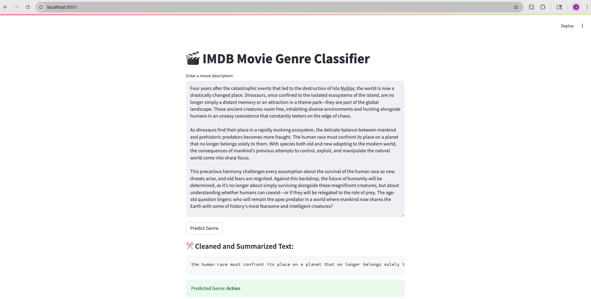

# MLDS_414_Text_Analytics_Movie_Genre

[TODO: short description]

## Project Structure

[TODO]

## Project Goals

[TODO]

## Models

[TODO]

## Run the Project

### 1. Install Dependencies
```bash
conda create -n 414-final-proj python=3.9
conda activate 414-final-proj
pip install -r requirements.txt
```

### 2. Train the Model [TODO: add in all models]
```bash
python DistilBERT_genre_training.py

# optional for inference
python DistilBERT_genre_inference.py --text "A man must fight through zombies to protect his family."

```

### 3. Start the Backend and Frontend
```bash
python backend/app.py
streamlit run streamlit_app.py
```

## Example Use Case

Paste the movie description to the app UI:

> A man must fight through zombies to protect his family.

Output: 

> Action



## Evaluation

```json
{
    "eval_loss": 0.6348124146461487,
    "eval_accuracy": 0.735,
    "eval_runtime": 0.6218,
    "eval_samples_per_second": 321.655,
    "eval_steps_per_second": 8.041,
    "epoch": 3.0
}
```

## Authors

[TODO]